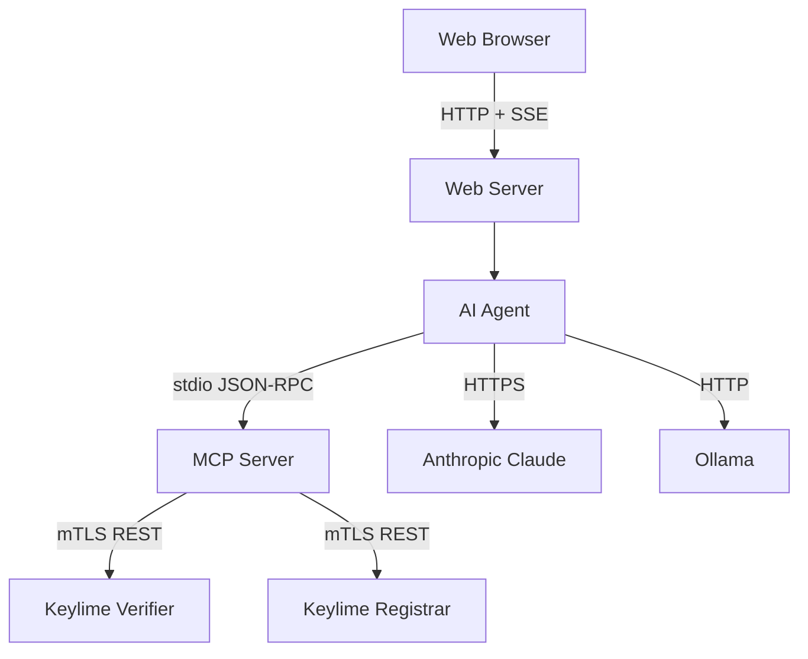

# Architecture

## Overview

The project compiles into two independent binaries. The **MCP server** (`bin/server`) handles all communication with Keylime via mTLS and exposes operations as MCP tools. The **client** (`bin/client`) hosts an AI agent, web server, and browser-based chat interface.

The server can be used standalone with any MCP-compatible client (Claude Code, Claude Desktop, Cursor, etc.) or paired with the bundled web client.

## Component Diagram



## Project Structure

```
cmd/
  server/          MCP server entry point
  client/          Web client entry point
internal/
  keylime/         Keylime API client, mTLS config, request/response types
  mcptools/        MCP tool definitions, input validation, response mapping
  agent/           LLM provider abstraction (Anthropic, Ollama)
  masking/         Data sanitization — masks sensitive fields before sending to LLMs
  web/             HTTP server, SSE streaming, HTML templates
e2e/               Testing Farm plans and test scripts
```

## Design Notes

**Data masking.** When using cloud LLM providers, sensitive Keylime data (UUIDs, certificates, keys) is masked before leaving the server. The masking engine replaces real values with contextual aliases that the LLM can still reason about, then unmasks tool call parameters before execution.

**Safe operations.** Destructive actions like re-enrollment validate preconditions first. `Update_agent` checks that the agent exists in the Registrar and that requested policies are available on the Verifier before unenrolling, preventing the agent from being left unprotected if re-enrollment fails.

**Provider abstraction.** The agent package defines a generic provider interface. Switching between Anthropic Claude (cloud) and Ollama (local) requires only changing an environment variable, not code. New providers can be added by implementing the interface.
